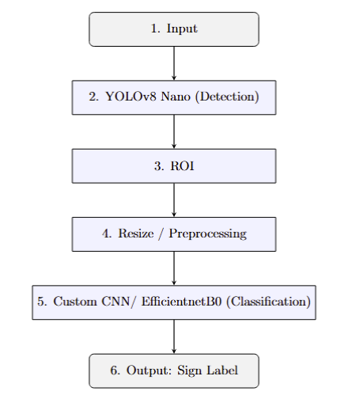

# ROAD SIGNS CLASSIFICATION

A REST API built with FastAPI that asynchronously processes road sign detections and stores them in PostgreSQL. It serves a client application developed in React and TypeScript. For classification, the application uses two models: a custom CNN and EfficientNet-B0 trained on the GTSRB dataset. For detection, it leverages YOLOv8 Nano fine-tuned on the GTSDB dataset.

**Architecture of pipeline:**

<center>



</center>

## Tech Stack

- **ML:** Keras, Tensorflow, Python
- **Backend:** FastAPI, SQLAlchemy, pydantic-settings
- **Frontend:** React, TS
- **Database:** PostgreSQL
- **Tools:** Docker

## Features

**System features:**

- Detects road signs from street images, crops them, and passes them to the classification models.
- Leverages asynchronous FastAPI endpoints to ensure non-blocking communication with the database.
- Asynchronously logs detection history, including confidence scores and timestamps, into the PostgreSQL `DetectionHistory` table.

**ML evaluation:**

- Precision, Recall, F1-Score Weighted
- Balanced Accuracy, Top-3 Accuracy
- Confusion matrix & Confidence distribution
- FLOPs & Robustness Test

## How to run

**Step 1: Clone the repository**

```bash
git clone https://github.com/RumaxDA/road-signs-classification
cd road-signs-classification
```

**Step 2: Environment configuration**

```bash
cp .env.example .env
```

**Step 3: Download AI Models**

- Go to Releases page of this repository.
- Download the model weights: best.pt, cnn_48_v1.keras, efficientnet_b0_224_v1.keras, efficientnet_b0_96_v1.keras.
- Place the downloaded files directly into the models_ai/ directory in backend.

**Step 4: Build and run the application**

```bash
docker compose up --build
```

**Access points:**  
Frontend UI: http://localhost:5173  
API Documentation: http://localhost:8000/docs  
